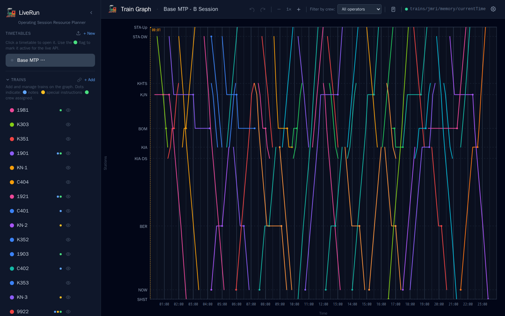
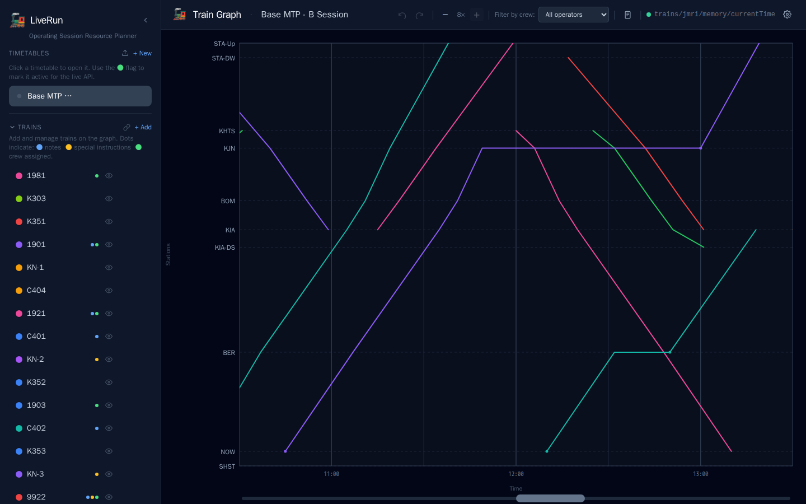
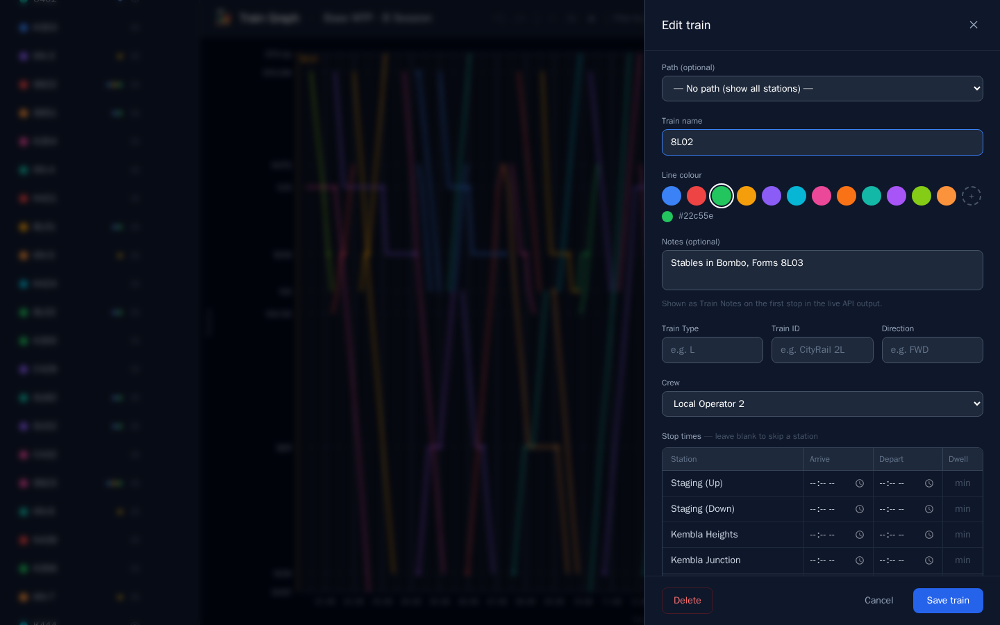
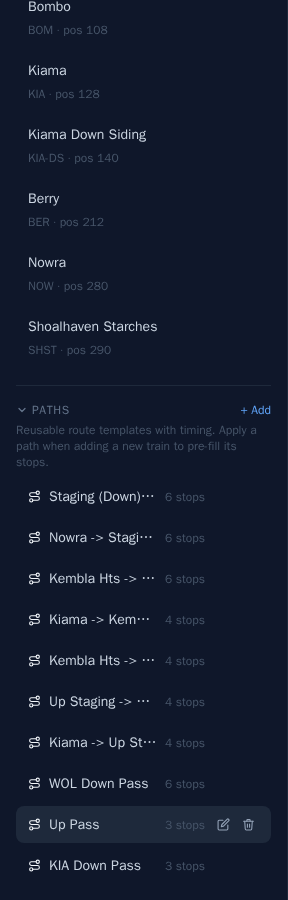
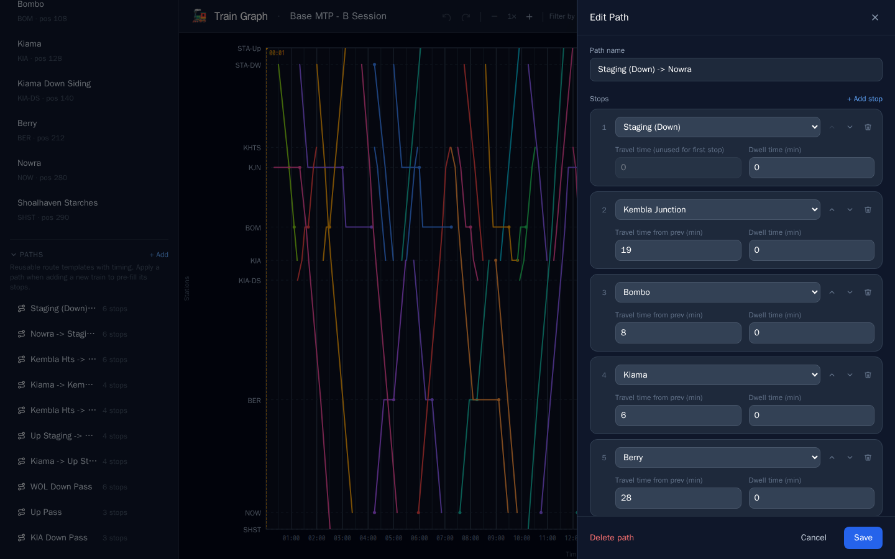
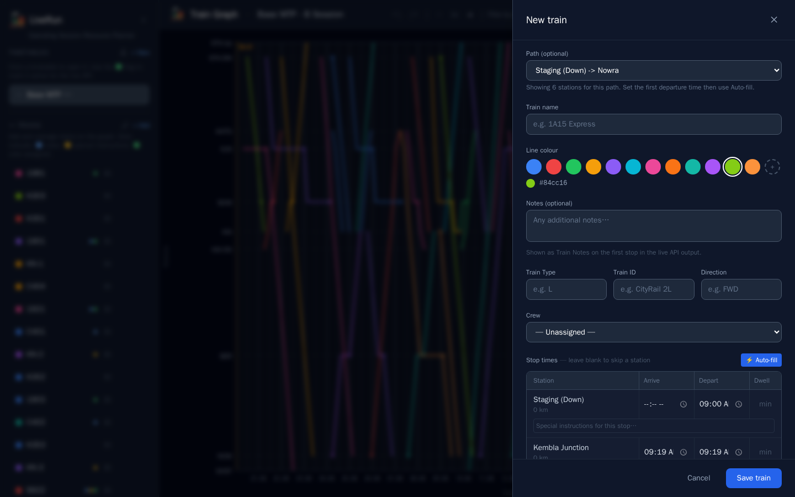
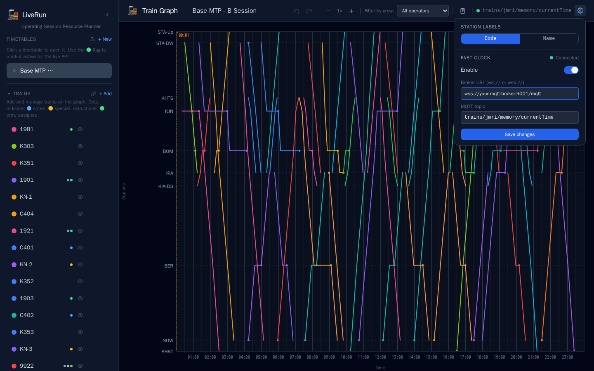
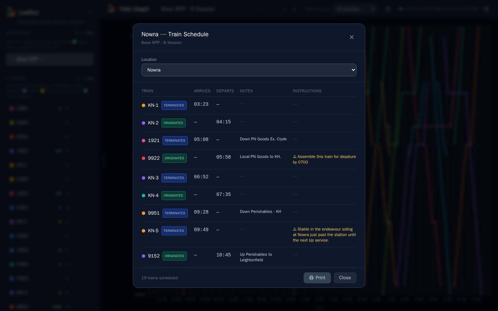

# LiveRun — Operating Session Resource Planner

**LiveRun** is a web application for planning and running model railway operating sessions. Build interactive train stringline (time-distance) graphs, assign operators, track a live fast clock, and expose real-time timetable data to external systems like JMRI guard panels.



---

## Features

### Timetable Management
- **Multiple timetables** — create and switch between independent operating scenarios
- **Import / Export** — back up and restore timetables as JSON; export to CATS XML for use in other tools
- **Active timetable flag** — mark one timetable as active so external systems (guard panels, operator displays) always resolve the current session automatically
- **Duplicate** — clone an existing timetable as a starting point for a new session

### Train Graph
- **Interactive stringline graph** — time on the X axis, stations on the Y axis; each train is a coloured line
- **Distance-scaled Y axis** — stations are positioned to true distance scale using graph position values
- **Configurable time window** — set custom start and end times per timetable
- **Zoom** — zoom up to 8× on the time axis for detailed planning
- **Real-time preview** — graph updates live as you edit stop times
- **Tooltips** — hover any train line to see its name, origin, destination, and stop times
- **Show / hide trains** — toggle individual trains on/off without deleting them
- **Undo / Redo** — full undo history across the session



### Trains
- **Colour-coded trains** — 12 preset colours plus a custom colour picker
- **Train metadata** — store train number, type, roster ID, direction, and free-text notes
- **Special instructions** — per-stop notes visible on guard panels and operator displays
- **Dot indicators** on the train list: 🔵 notes · 🟡 special instructions · 🟢 crew assigned



### Crew Management
- **Define operators** — create named crew members with assigned colours
- **Assign trains to crew** — link each train to an operator in the train editor
- **Auto-assign** — automatically distribute trains across selected crew members
- **Graph filter** — filter the graph in the header bar to show only one operator's trains
- **Crew hover highlight** — hover a crew member to highlight all their trains on the graph

### Paths (Route Templates)
- **Reusable path templates** — define a route with station sequence and travel/dwell times
- **Apply to new trains** — pre-fill all stop times when adding a train, based on a departure time







### Fast Clock Integration
- **MQTT fast clock** — subscribe to a broker topic (e.g. from JMRI) to show a live session clock on the graph
- **Visual indicator** — status dot and topic name shown in the header bar
- **Configurable** — set broker URL (`wss://`) and topic per timetable



### Live API for External Systems
- Read-only REST API for guard panels, operator apps, and JMRI integrations
- Returns active train list and full stop-by-stop timetables
- All times formatted as `H:MM` (no leading zero) to match JMRI clock format



---

## Quick Start (development)

```bash
npm install
npm run dev
```

- Frontend: http://localhost:5173
- Backend API: http://localhost:3001

---

## Docker (production)

```bash
docker compose up -d
```

Access at **http://localhost:3001**. Data is persisted in a Docker volume (`liverun-data`).

---

## Usage

1. **Create a timetable** — click *+ New* in the sidebar. Set a name and time window (e.g. `06:00 – 22:00`)
2. **Add stations** — under *Stations*, click *+ Add*. Enter the station name, optional short code, and graph position (km or arbitrary units)
3. **Add paths** *(optional)* — under *Paths*, define a route template with travel and dwell times. Apply it when adding trains to pre-fill stops
4. **Add trains** — under *Trains*, click *+ Add*. Pick a colour, enter stop times, add notes and metadata. The graph updates live as you type
5. **Add crew** — under *Crew*, add operator names. Assign trains via the train editor or use *Auto-assign*
6. **Mark active** — click the 🟢 flag next to a timetable to expose it via the live API
7. **Configure fast clock** — click the ⚙️ cog in the top bar. Enter your MQTT broker URL and topic
8. **Export** — hover a timetable name to reveal export buttons: JSON (backup) or CATS XML

---

## CATS XML Export

Each timetable can be exported as a CATS-compatible XML file via the export button in the sidebar.

| CATS Field | LiveRun Source |
|---|---|
| `TRAIN_SYMBOL` | Train name |
| `ENGINE` | Train ID (roster) |
| `TRAIN_NAME` | Train notes (if < 50 characters) |
| `DEPARTURE` | First stop departure time |
| `f3` | First stop station name (origin) |
| `f4` | Last stop station name (destination) |

---

## Live / Public Timetable API

A read-only API for external systems. All times use `H:MM` format with no leading zero.

### Active timetable

**`GET /api/active-timetable`**

Returns the ID of the timetable currently marked active.

```json
{ "id": "abc123" }
```

`id` is `null` if no timetable is active. Fall back to `GET /api/timetables` in that case.

---

### List trains

**`GET /api/timetables/:id/live/trains`**

Returns all trains sorted by start time.

```json
{
  "trains": [
    {
      "name": "K351",
      "trainType": "L",
      "trainId": "CityRail 51L",
      "direction": "Down",
      "notes": "Stops on request at Minnamurra",
      "nextCrewService": "K352"
    }
  ]
}
```

| Field | Description |
|---|---|
| `name` | Train number / display name |
| `trainType` | Short type code (e.g. `L`, `T`, `V`) |
| `trainId` | Roster / JMRI name |
| `direction` | Direction of travel |
| `notes` | Free-text train notes |
| `nextCrewService` | Next train the same crew works, if assigned |

---

### Single train timetable

**`GET /api/timetables/:id/live/trains/:trainName`**

Returns the full stop-by-stop timetable for one train.

```json
{
  "name": "K351",
  "trainType": "L",
  "trainId": "CityRail 51L",
  "direction": "Down",
  "notes": "Stops on request at Minnamurra",
  "nextCrewService": "K352",
  "stops": [
    {
      "stopName": "Kiama",
      "arrival": null,
      "departure": "9:05",
      "specialInstructions": null
    },
    {
      "stopName": "Minnamurra",
      "arrival": "9:10",
      "departure": "9:10",
      "specialInstructions": "Request stop only"
    },
    {
      "stopName": "Shellharbour Junction",
      "arrival": "9:20",
      "departure": null,
      "specialInstructions": null
    }
  ]
}
```

| Field | Description |
|---|---|
| `stopName` | Station display name |
| `arrival` | Arrival time as `H:MM`, or `null` |
| `departure` | Departure time as `H:MM`, or `null` |
| `specialInstructions` | Per-stop note, or `null` |

---

## Project Structure

```
liverun/
├── server/           Express API server + JSON persistence
├── client/           React + TypeScript frontend (Vite + Tailwind)
├── Dockerfile        Multi-stage Docker build
└── docker-compose.yml
```
