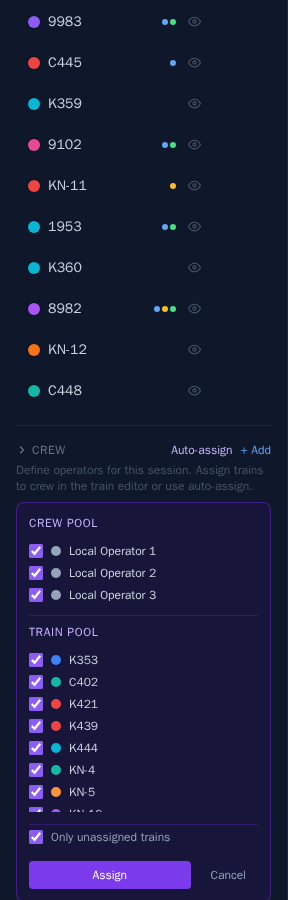
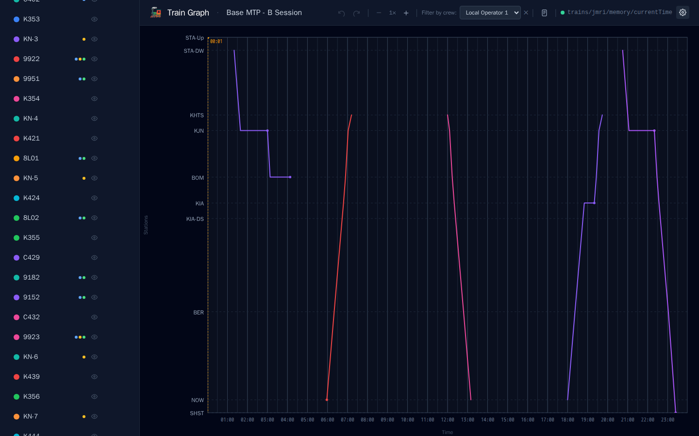
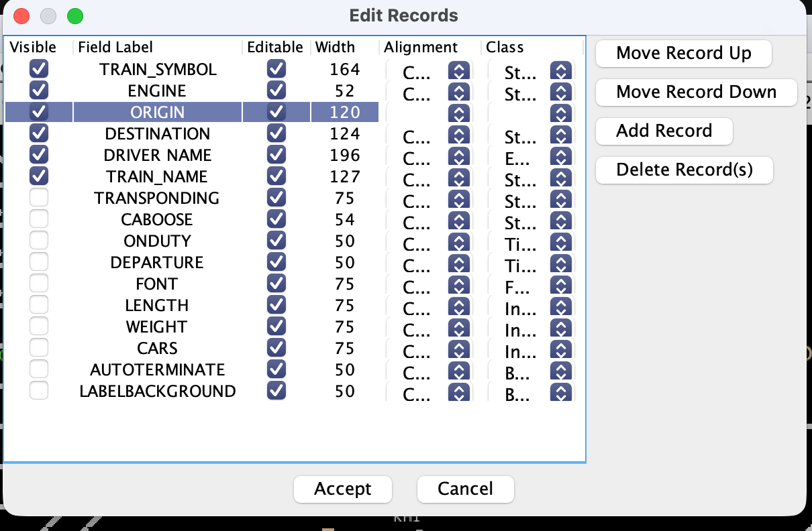

# LiveRun

**Plan and run your model railway operating sessions — from timetable to train graph to crew assignments, all in one place.**

LiveRun is a web app built for model railway clubs and home layouts. Build a stringline (time-distance) graph of your session, assign trains to operators, print station timetables, sync a live fast clock from JMRI, and expose your timetable to guard panels and operator displays via a read-only REST API.


---

## What you can do with LiveRun

| | |
|---|---|
| **Visualise your session** | Build an interactive train graph — see every service at a glance, zoom in for detail, hover for stop times |
| **Plan crew workloads** | Assign trains to operators, auto-distribute services, and filter the graph by crew member |
| **Speed up train entry** | Define reusable route templates (Paths) and auto-fill all stop times from a single departure time |
| **Print station registers** | Generate printable A5 timetables for each station — ready to hand out on the day |
| **Connect external systems** | Feed guard panels, JMRI displays, and operator apps from a live REST API |
| **Sync the fast clock** | Subscribe to an MQTT broker topic and see the session clock ticking on the graph |
| **Export to CATS** | One click exports your trains and crew roster as CATS XML |

---

## Features

### Train Graph

The heart of LiveRun — an interactive stringline graph with time on the X axis and stations on the Y axis.

- Stations are spaced to true distance scale using configurable graph position values
- Zoom up to **8×** on the time axis for detailed planning
- **Live updates** — the graph redraws instantly as you edit stop times
- Hover any train line for its name, origin, destination, and full stop list
- **Next service** indicator on the tooltip when the same locomotive runs again later in the session
- Show or hide individual trains without deleting them
- Full **undo / redo** history


### Timetables

- **Multiple timetables** — create and switch between independent operating scenarios
- **Configurable time window** — set a custom start and end time per timetable
- **Duplicate** — clone an existing timetable as a starting point for a new session
- **Import / Export** — back up and restore timetables as JSON

### Trains

- **Colour-coded** — 12 preset colours plus a custom colour picker
- **Rich metadata** — train number, type, roster ID, direction, and free-text notes
- **Special instructions** — per-stop notes surfaced on guard panels and operator displays
- At-a-glance dot indicators on the train list: 🔵 notes · 🟡 special instructions · 🟢 crew assigned


### Crew Management

Organise your operators and distribute work fairly.

- Create named crew members with colour coding
- Assign trains manually or use **Auto-assign** to distribute services across selected operators
- Filter the graph to a single operator's trains with one click
- Hover a crew member in the sidebar to highlight all their trains on the graph
- Drag to reorder crew members





### Paths — Route Templates

Stop entering stop times from scratch. Define a route once and reuse it.

- Set up a station sequence with travel times and dwell times
- When adding a train, pick a path and enter a departure time — all stops are filled automatically


### Station Report

Generate a printable arrival/departure register for any station.

- Shows all services with arrival, departure, service type (`[ORG]` / `[CAL]` / `[TRM]`), train notes, and special instructions
- **A5 landscape** format in a dot-matrix register style — print and hand out at each physical station
- Open via the printer icon in the header toolbar


### Fast Clock

- Connect to an **MQTT broker** (e.g. from JMRI) to show a live session clock on the graph
- Status dot and topic name displayed in the header
- Broker URL and topic are configured per timetable


### Live API for External Systems

Mark a timetable as *active* and it's immediately available to guard panels, JMRI displays, and operator apps via a read-only REST API. See the [API reference](#live-timetable-api) below.

---

## Getting Started

The easiest way to run LiveRun is with **Docker Desktop** — a free app that runs LiveRun in a self-contained environment with no setup, no dependencies, and no risk of breaking anything else on your computer.

### Step 1 — Install Docker Desktop

Go to **https://www.docker.com/products/docker-desktop** and download the installer for your operating system (Windows or Mac). Run it and follow the prompts. Once installed, open Docker Desktop and wait for it to show the green "Engine running" status in the bottom-left corner. You only need to do this once.

### Step 2 — Download LiveRun

Click the green **Code** button at the top of this page and choose **Download ZIP**. Extract it somewhere convenient (e.g. your Desktop or Documents folder).

### Step 3 — Open a terminal in the LiveRun folder

- **Windows:** Open the extracted folder in File Explorer, then click the address bar at the top, type `cmd`, and press Enter.
- **Mac:** Right-click the extracted folder and choose *New Terminal at Folder* (or open Terminal and drag the folder in).

### Step 4 — Start LiveRun

Paste this command into the terminal and press Enter:

```bash
docker compose up -d
```

Docker will download LiveRun (this takes a minute or two the first time) and start it. When it finishes, open your browser and go to:

**http://localhost:3001**

That's it — LiveRun is running.

### Stopping and starting

- **Stop LiveRun:** `docker compose down`
- **Start it again:** `docker compose up -d`

Your data is saved automatically between restarts. You won't lose anything by stopping LiveRun.

### Updating to a newer version

```bash
docker compose pull && docker compose up -d
```

This downloads the latest version and restarts the app. Your data is untouched.

---

### For developers

```bash
npm install
npm run dev
```

- App: http://localhost:5173
- API: http://localhost:3001

---

## Running your first session

1. **Create a timetable** — click *+ New* in the sidebar. Give it a name and set the time window (e.g. `06:00 – 22:00`)
2. **Add stations** — under *Stations*, click *+ Add*. Enter the station name, optional short code, and graph position (km or arbitrary units)
3. **Add paths** *(optional but recommended)* — under *Paths*, define a route with travel and dwell times per stop. You can apply these when adding trains to auto-fill all stop times
4. **Add trains** — under *Trains*, click *+ Add*. Choose a colour, set stop times (or apply a path), and add any notes or metadata. The graph updates as you type
5. **Add crew** — under *Crew*, add your operators. Assign trains via the train editor or click *Auto-assign*
6. **Mark active** — click the 🟢 flag on a timetable to expose it via the live API
7. **Configure fast clock** — click ⚙️ in the top bar and enter your MQTT broker URL and topic
8. **Export** — hover a timetable name to reveal export options: JSON backup or CATS XML

---

## CATS XML Export

Exporting via the sidebar generates two files:

- **`{name}.xml`** — trains in CATS XML format, sorted chronologically by first departure
- **`{name}-crews.xml`** — crew roster XML (only includes operators assigned to at least one train)

| CATS Field | LiveRun Source |
|---|---|
| `TRAIN_SYMBOL` | Train name |
| `ENGINE` | Train ID (roster) |
| `TRAIN_NAME` | Train notes (if < 50 characters) |
| `DEPARTURE` | First stop departure time |
| `f3` | Origin station name |
| `f4` | Destination station name |

> **Before importing, you need ORIGIN and DESTINATION fields configured in CATS Designer.** Open CATS Designer and go to **Train → Edit Train Fields**. The field keys `f3` and `f4` refer to the **3rd and 4th fields** in that list — whatever fields occupy those positions will receive the origin and destination values from the export. Make sure your 3rd and 4th fields are set up as String fields labelled `ORIGIN` and `DESTINATION` respectively:
>
> 
>
> If the 3rd and 4th fields don't exist, or are a different type, CATS will silently ignore the origin and destination values on import.

---

## Security

LiveRun has no in-app authentication. It is designed for **trusted local networks** — home layouts and club rooms — not public internet exposure.

### How it is secured

- **LAN-only exposure** — the app listens on port 3001 and is accessible to any device on your local network. It is not designed to be exposed to the public internet. Don't forward port 3001 on your router.
- **Security headers** — Helmet sets `X-Frame-Options`, `X-Content-Type-Options`, HSTS, and other standard hardening headers on every response.
- **Rate limiting** — API routes are capped at 200 requests per minute to blunt automated abuse.

### Recoverability

Even in the unlikely event that someone on the LAN makes an unwanted change, the damage is limited. **Timetables can be exported and re-imported as JSON** — export your timetables before a session as a backup and you can restore to any previous state in seconds.

---

## Live Timetable API

A read-only REST API for connecting guard panels, JMRI displays, and operator apps to the active session. Full endpoint reference is available at **`/api/docs`** when the app is running.

### Quick endpoint guide

- `GET /api/active-timetable`
  Returns `{ id }` for the timetable currently marked active.

- `GET /api/timetables/{id}/live/trains`
  Returns all services sorted by start time.

- `GET /api/timetables/{id}/live/trains/{trainName}`
  Returns the full timetable and stopping list for one service.

- `GET /api/timetables/{id}/live/stations/{stationName}`
  Returns all services calling at a station, including each service's onward stopping pattern from that station.

- `GET /api/timetables/{id}/live/stations/{stationName}?direction=up`
  Same as above, filtered to Up services only. Use `direction=down` for Down services.
  Up/Down is determined by station order: moving toward higher station order is `down`, lower station order is `up`.

- `GET /api/timetables/{id}/live/stations/{stationName}?trainId=%cityrail%`
  Optional TrainID wildcard filter (case-insensitive).
  `%` matches any sequence and `_` matches a single character.

### Example station display flow

1. Call `/api/active-timetable` and read the returned `id`.
2. Call `/api/timetables/{id}/live/stations/Kiama` for a full board (both directions).
3. Call `/api/timetables/{id}/live/stations/Kiama?direction=down` for a direction-specific board.

### WebSocket station feed

For a live station board that updates as time advances, connect to:

- `ws://localhost:3001/api/live/station-feed?id={timetableId}&station={stationName}&direction=up`
- `direction` is optional (`up` or `down`). Omit it for both directions.
- `trainId` is optional and supports case-insensitive wildcards, e.g. `trainId=%cityrail%`.
- Optional tuning:
  - `futureCount` (default `10`) limits results to the next N future services.

The WebSocket feed is driven by the timetable fast clock MQTT settings (`clock_enabled`, `clock_broker_url`, `clock_topic`).
On connect, LiveRun subscribes to that topic and pushes a new station feed snapshot whenever the clock value changes.

On connect, the server sends:

- `type: "hello"` once
- `type: "stationFeed"` repeatedly with:
  - `clockTime`
  - `services[]`
  - `minutesUntil` per service

### Browser inspector page

LiveRun includes a built-in WebSocket inspector page for testing this feed in your browser:

- `http://localhost:3001/ws-inspector.html` (Docker / production server)
- `http://localhost:5173/ws-inspector.html` (Vite dev server)

Enter your timetable ID and station, click **Connect**, and watch incoming messages in real time.
You can also launch it directly from the app header via **WS Inspector**.

---

## Project Structure

```
liverun/
├── server/           Express API + SQLite persistence
├── client/           React + TypeScript frontend (Vite + Tailwind)
├── Dockerfile        Multi-stage Docker build
└── docker-compose.yml
```
